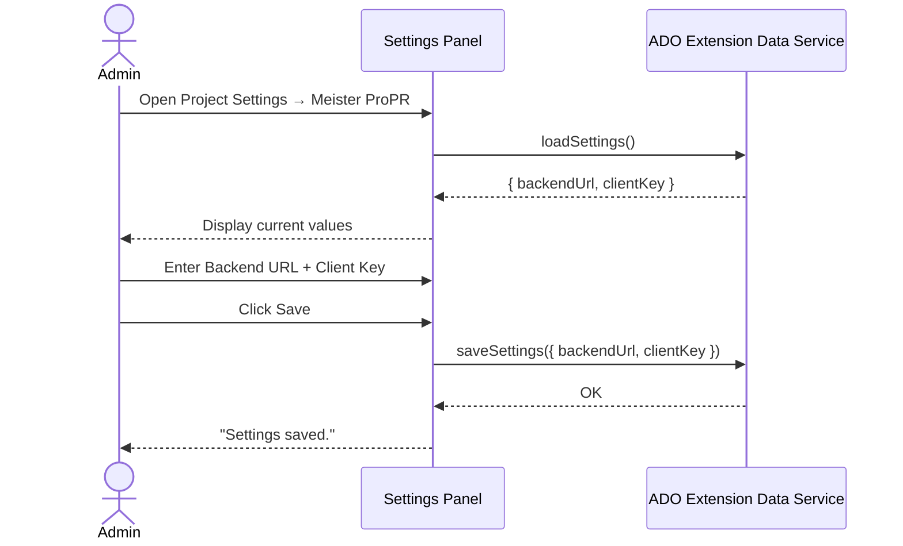
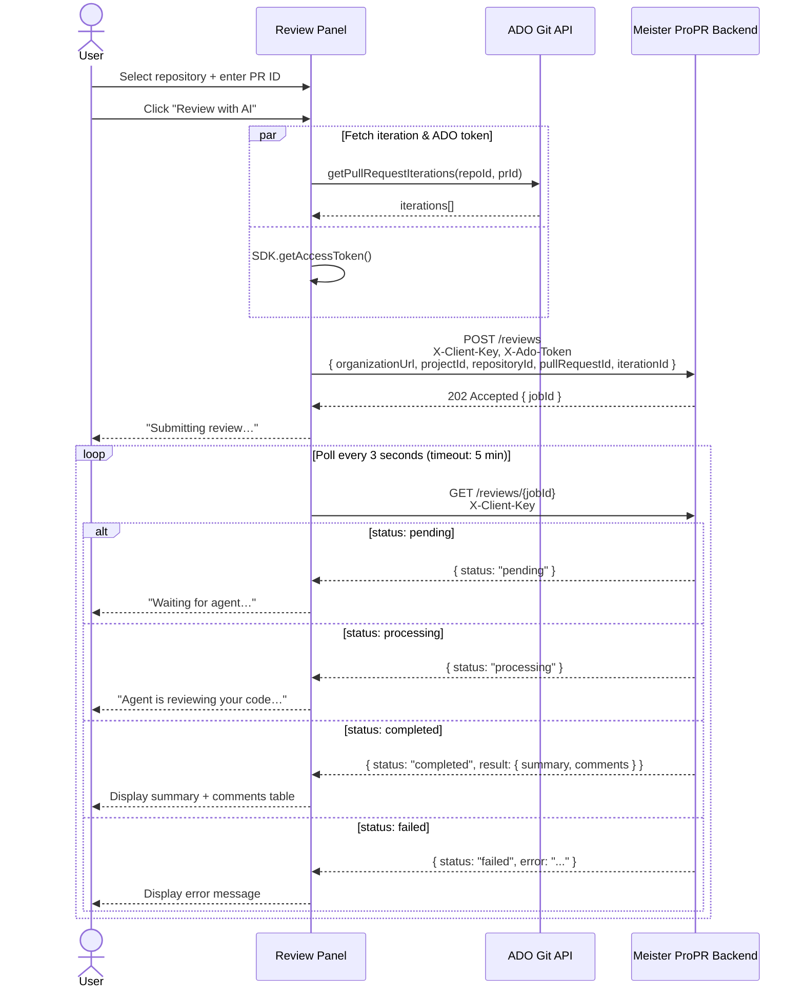
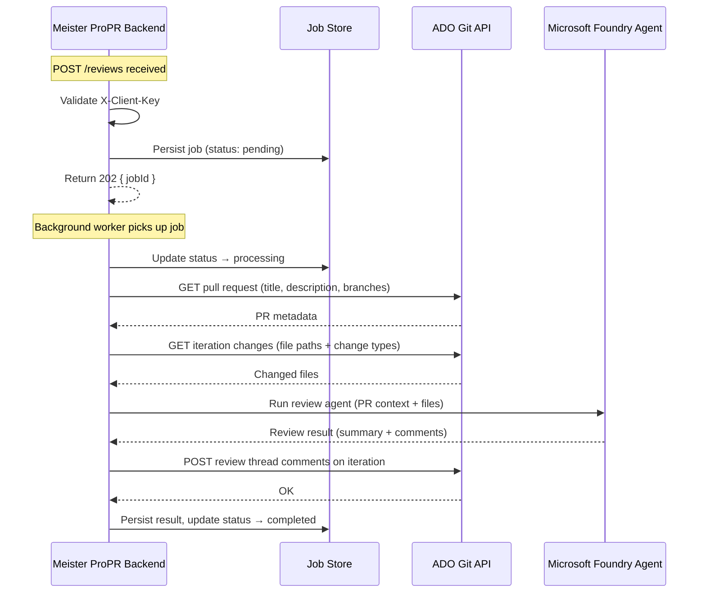

# Extension Documentation

## Overview

This is the Azure DevOps web extension for **Meister ProPR**. It runs inside Azure DevOps (in the browser, inside an iframe) and provides two contributions: a **settings panel** where admins configure the backend connection, and a **review panel** where users select a repository and pull request, trigger an AI code review, and view the results returned by the backend.

The backend performs the review asynchronously — it fetches changed files directly from ADO and posts review comments back to the PR. The extension submits the job and polls for the result.

---

## Project structure

```
extension/
├── package.json              — npm project (dependencies, build scripts)
├── tsconfig.json             — TypeScript compiler config
├── webpack.config.js         — Webpack build config
├── vss-extension.json        — ADO extension manifest
├── settings.html             — Static HTML host page for the settings contribution
├── review.html               — Static HTML host page for the review contribution
└── src/
    ├── common/
    │   └── extensionSettings.ts  — Typed wrapper around IExtensionDataService
    ├── api/
    │   ├── models.ts             — Shared DTOs (ReviewRequest, ReviewJob, ReviewStatusResponse, etc.)
    │   └── reviewClient.ts       — Typed axios wrappers for POST /reviews and GET /reviews/{jobId}
    ├── settings/
    │   ├── settings.ts           — Settings panel logic
    │   └── settings.css          — Settings panel styles
    └── review/
        ├── review.ts             — Review panel logic (submit + poll)
        └── review.css            — Review panel styles
```

---

## Build system (Webpack)

**Why Webpack?** ADO extensions run as a single bundled JS file per contribution page. Webpack compiles TypeScript, resolves npm imports (axios, ADO SDK, etc.), and bundles everything into one output file per entry point.

**Entry points:** one per contribution page — `settings.ts` and `review.ts`. Each produces a standalone bundle (`dist/settings.js`, `dist/review.js`) that the corresponding HTML page loads.

**Loaders used:**
- `ts-loader` — compiles TypeScript to JavaScript using the project's `tsconfig.json`
- `style-loader` + `css-loader` — allows CSS files to be `import`-ed from TypeScript; webpack injects them as `<style>` tags at runtime

**Build modes:**
- `npm run build` → production build (minified, optimized)
- `npm run build:dev` → development build (source maps, no minification, faster rebuilds)

No build mode is hardcoded in `webpack.config.js`; it is passed via the CLI flag so both commands share the same config.

---

## Extension manifest (`vss-extension.json`)

**ADO contribution model:** An extension declares _contributions_ — UI extension points that Azure DevOps loads at the declared target location. Each contribution references an HTML page (`uri`) that ADO loads in an iframe.

**Contributions:**

| ID | Target | Purpose |
|---|---|---|
| `settings-hub` | `ms.vss-web.project-admin-hub-group` | Appears in Project Settings; admin-only by placement |
| `review-hub` | `ms.vss-code-web.code-hub-group` | Appears in the Repos section of the project navigation |

**`vso.code` scope:** Required so the extension can call the ADO Git REST API (list repositories, fetch PR iterations). This scope is declared in `scopes` and requested at extension installation time.

**Addressable files:** `dist/`, `settings.html`, and `review.html` are marked `"addressable": true`, which means they can be served over HTTPS directly by the ADO extension CDN.

**Publisher:** The `publisher` field must be set to your actual Marketplace publisher ID before deploying.

---

## ADO SDK usage

### `IExtensionDataService` — settings storage

Settings are persisted using ADO's built-in extension data storage, accessible via `IExtensionDataService` from `azure-devops-extension-api`. Only two values are stored: `backendUrl` and `clientKey`.

```
SDK.getService(CommonServiceIds.ExtensionDataService)
  → IExtensionDataManager
    → getValue / setValue
```

**Why `scopeType: 'Default'`?** Settings are organisation-level: the backend URL and client key are shared across all users in the org. `'Default'` scope stores values at the organisation level.

### `GitRestClient` — PR iteration data

The review panel uses the ADO Git REST client to fetch the list of PR iterations, in order to resolve the latest `iterationId` to send to the backend.

```typescript
gitClient.getPullRequestIterations(repositoryId, pullRequestId, projectId)
```

The backend uses the `iterationId` to fetch the changed files itself and to post review comments on the correct iteration.

### `SDK.getAccessToken()` — ADO token for the backend

The extension obtains the current user's ADO access token and forwards it to the backend as the `X-Ado-Token` header. The backend uses this token to:
- Fetch PR metadata and changed files from the ADO Git API
- Post review thread comments back to the pull request on the specified iteration

### SDK lifecycle (`SDK.init` / `SDK.notifyLoadSucceeded`)

ADO shows a loading spinner until the extension signals readiness:

```typescript
await SDK.init({ loaded: false }); // register with ADO host, but hold the spinner
// ... async initialization ...
SDK.notifyLoadSucceeded();         // dismiss spinner, show content
```

`loaded: false` allows async work (loading settings, fetching repositories) to complete before the UI is shown.

---

## Configuration model

Only two settings are stored in the extension — Foundry credentials are managed entirely by the backend deployment and are never exposed to the browser.

| Setting | Stored in | Used by |
|---|---|---|
| Backend URL | Extension data storage | Base URL for all backend API calls |
| Client key | Extension data storage | Sent as `X-Client-Key` header to authenticate the org |

### Settings save flow



---

## API client (`reviewClient.ts`)

`reviewClient.ts` contains typed axios wrappers for the three backend endpoints defined in `../meister-propr/openapi.json` (if checked out there):

```
POST {backendUrl}/reviews
  Headers: X-Client-Key, X-Ado-Token
  Body: { organizationUrl, projectId, repositoryId, pullRequestId, iterationId }
  Response 202: { jobId }

GET {backendUrl}/reviews/{jobId}
  Headers: X-Client-Key
  Response 200: { status, result?, error?, ...jobMeta }

GET {backendUrl}/reviews
  Headers: X-Client-Key
  Response 200: ReviewListItem[]
```

To regenerate a fully typed client from the OpenAPI spec:

```bash
npm run generate:api
```

This runs `openapi-typescript-codegen --input ../backend/openapi.json --output src/generated/`.

---

## Review panel UX

**Input:**
1. Select a repository from the dropdown (populated from ADO on load)
2. Enter a pull request ID

**Review flow:**
1. The extension fetches the PR's iteration list and resolves the latest `iterationId`
2. `POST /reviews` is called with the PR identifiers and the current user's ADO token; the loading indicator shows `"Submitting review…"`
3. The extension polls `GET /reviews/{jobId}` every 3 seconds, updating the indicator to `"Waiting for agent…"` or `"Agent is reviewing your code…"` based on the job status
4. On `completed`: the summary and per-file comments are rendered in the results table
5. On `failed`: the server's error message is displayed
6. Polling times out after 5 minutes with a user-facing error

**Results table columns:** File | Line | Severity | Comment

### Review flow — extension side



### Review flow — backend side



---

## Packaging

```bash
npm run package
```

Runs `tfx extension create --manifest-globs vss-extension.json` and produces a `.vsix` file. The `.vsix` is a zip archive containing the manifest, `dist/`, and the HTML files.

Before publishing to the marketplace:
1. Update `publisher` in `vss-extension.json` to your actual publisher ID
2. Bump `version` as needed
3. Run `tfx extension publish` (or upload the `.vsix` manually in the marketplace portal)
